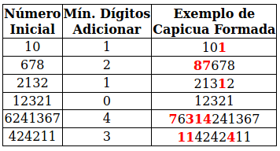

# Explicação do problema DAA019 - Capicuas

## O problema

Escreva um programa que, dado um conjunto de N números, descubra para cada um deles qual a menor quantidade de dígitos a adicionar a cada um deles para os transformar numa capicua.

{#id .class width=200px height=200px}

## Resolução

A primeira abordagem em qualquer problema de __Dynamic Programming__ é sempre perceber bem o que é pedido (isso é válido não só em DP, mas em qualquer problema). Podemos imaginar que um número pode ser descrito por `"aXb"`, onde a é o primeiro dígito do número e b, o último. Se estivermos calculando a quantidade de dígitos que temos que adicionar para tornar o número uma capicua usando uma função `count(num)`, então se $a = b$, `count(num) = 0 + count(X)`. Caso contrário, `count(num) = 1 + count(X)`.  Como já lidamos com o primeiro e último dígito, faremos a mesma comparação para o número `X`, este que é um subproblema similar. Note também que a escolha do lado em que iremos adicionar o novo dígito importa: tome como exemplo o número $6241367$. Inicialmente, vamos supor que nosso algorítimo, ao verificar que $a \neq b$, simplesmente adiciona um dígito no final do número e, em sequência, faz a mesma comparação para o número do meio `X`. Neste caso, teríamos: 

1) Inicialmente, comparamos o primeiro dígito com o último: $6 \neq 7$, portanto adicionamos um 6 no final do número, fazendo com que a quantidade de dígitos necessários para transformá-lo numa capicua, até agora, seja `total = 1`. O número fica portanto $62413676$. Agora, fazemos a mesma coisa para o número "do meio" 241367.

2) Fazemos o mesmo processo para o número 241367. Como $2 \neq 7$, adiciona-se $2$ no final número e ficamos com $2413672$ e com `total = 2`, pois tivemos que adicionar um dígito ao número.

Já nesse ponto podemos parar e refletir em algo. E se o nosso algorítimo adicionasse um novo dígito não no final do número, mas sim no início dele? Se refizermos o processo, em 1) ficaríamos com $76241367$ (`total = 1` da mesma maneira), mas em 2) verificamos que no número 624136 $a = b$ e não precisamos adicionar nenhum dígito ao número. Temos então duas formas pelas quais podemos adicionar dígitos ao número. Qual então seria a melhor forma de ter certeza que estamos usando aquela que adiciona a menor quantidade de dígitos ao número? Bem, devemos simplesmente comparar os dois métodos e usar o método que adiciona... o menor número de digitos! Isso se transmite naturalmente para um código recursivo como veremos a seguir.

Podemos implementar nosso algoritimo trabalhando com o número em formato `String`. Dessa forma, podemos selecionar a posição de dígitos facilmente com o método do java `String.charAt()`. Se à primeira posição da string `num` dermos o nome de `l` e chamarmos a última posição `r`, a solução recursiva para esse problema pode ser então desenvolvida:

```java
public static int count(String num, int l, int r){
	if(l >= r) return 0; 
	if(num.charAt(l) == num.charAt(r)) 
        return 0 + count(num,l+1,r-1,c);
	else
	    return 1 + Math.min(count(num,l+1,r), count(num,l,r-1)); 
	
}
```

Entretanto, este algoritimo calcula várias vezes o mesmo valor para cada par $(r,l)$. É possível ver isso na figura abaixo para o número 25234:

{#id .class width=400px height=400px}

Note que a função calcula o número de dígitos necessários para tornar $52$ capicua 2 vezes (para $23$ são necessárias 3). Quanto maior a quantidade de dígitos do número `num`, mais ineficiente este algoritimo se torna (é de facto exponencial!). 

É aqui que utilizamos __Dynamic Programming__ (juntamente com **memoization**). O poder dessa técnica está no facto de reutilizar resultados que já foram calculados, tornando o o processo muito mais eficiente (complexidade polinomial). Para guardar os resultados de posições $(r, l)$ já calculados, usaremos uma matrix que contém a quantidade de dígitos necessários para tornar o número uma capicua indo da posição `l` até a posição `r`. Esse número fica guardado, então, em `c[l][r]`. Ao utilizarmos isso, nosso algoritimo fica:

```java
public static int count(String num, int l, int r, int[][] c){
	if (c[l][r] != -1) return c[l][r]; 
	if(l >= r) return 0;
	int ans;
	if(num.charAt(l) == num.charAt(r))
	    ans = 0 + count(num,l+1,r-1,c);
	else
	    ans = 1 + Math.min(count(num,l+1,r,c), count(num,l,r-1,c));
	c[l][r] = ans;
	return ans;
}
```
A primeira linha do método `count()` checa se o resultado que queremos já foi calculado anteriormente. Caso afirmativo, esse resultado é retornado (e o cálculo é feito apenas uma vez). No final, o resultado `ans` para um dado par $(r, l)$ é salvo na matrix `c[l][r]`. A imagem a seguir mostra como não são mais feitos cálculos repetidos para pares $(r, l)$ para o número 25234.

{#id .class width=400px height=400px}

Verifica-se que só é calculado valores para o númrero 52 e 23 uma vez devido ao fato de que guardamos esses valores para quando, na stack recursiva, eles precisarem serem novamente calculados.

A função `main()` desse problema fica então:

```java
public static void main(String[] args){
	Scanner stdin = new Scanner(System.in);
	int n = stdin.nextInt();
	for(int i=0;i<n;i++){
	    String num = stdin.next();
	    int L = num.length();
	    //matrix that will store number of digits to add to number from position l to r
	    int[][] c = new int[L][L];
	    

        //initializing matrix with unused values
	    for(int k=0;k<L;k++)
		    for(int m=0;m<L;m++)
		        c[k][m] = -1;
	    System.out.println(count(num,0,L-1,c));
	}
}
``` 

Com a explicação deste (excelente) exercício é possível ver o motivo pelo qual DP é uma ferramenta bastante útil e versátil na solução de problemas de optimização.

